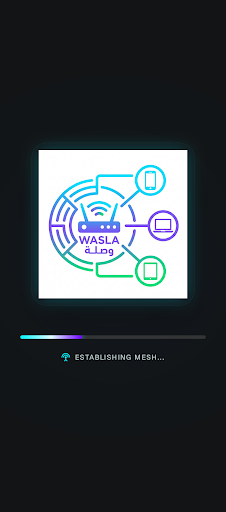
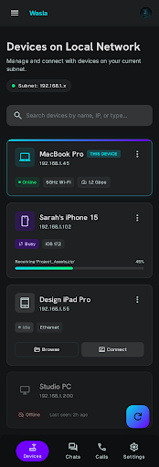
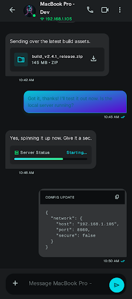
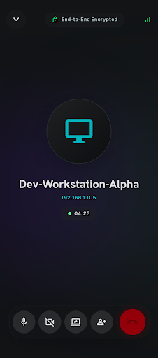
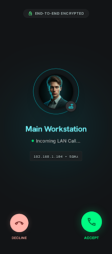

# Wasla — Stitch Screens Gallery

> تصاميم الشاشات من Google Stitch | Design System: Kinetic Ether

---

## الشاشات المصممة (5 من 10)

---

### 1. Splash Screen

**التفاصيل:**
- خلفية `#121416` مع Cyan glow + Purple orbital glow + grid pattern
- لوجو 256x256 مع Glassmorphic backing
- Progress bar بـ gradient من Cyan لـ Purple
- نص: "ESTABLISHING MESH..."

---

### 2. Connected Devices (Home Screen)

**التفاصيل:**
- Top Bar: اسم "Wasla" بلون Cyan + avatar
- عنوان: "Devices on Local Network"
- Subnet Chip + Search Bar
- Device Cards بـ 4 حالات: Active / Busy / Idle / Offline
- Bottom Nav: Devices | Chats | Calls | Settings
- FAB: gradient دايري (Cyan → Purple)

---

### 3. Chat Screen

**التفاصيل:**
- Top Bar: Device avatar + اسم + IP + call buttons
- الرسائل الواردة: `#282A2C` rounded
- الرسائل المُرسَلة: gradient Cyan → Purple
- Input Bar: `#0C0E10` border + attach + Send بـ Cyan

---

### 4. Active Call Screen

**التفاصيل:**
- خلفية atmospheric (cyan + purple glow)
- Avatar دايري 160x160 مع ripple effects
- Timer pill مع dot أخضر
- Controls Pill (Glassmorphism): Mic | Camera | Screen Share | Add | End Call
- End Call: 64x64 مع red glow

---

### 5. Incoming Call Screen

**التفاصيل:**
- "Secure Connection" chip في الأعلى
- Avatar + اسم المتصل + "Incoming call" chip
- Network Chip (LAN/5GHz)
- Decline (أحمر) + Accept (أخضر)

---

## الشاشات المطلوبة لسه

| # | الشاشة | الملاحظات |
|---|--------|-----------|
| 6 | Onboarding Screen | اسم الجهاز + UUID generation |
| 7 | Outgoing Call Screen | "جاري الاتصال بـ..." |
| 8 | Active Video Call | Grid layout للفيديو |
| 9 | Screen Share Screen | Overlay على المكالمة |
| 10 | Settings Screen | اسم الجهاز + إعدادات |

---

> **ملاحظة:** الـ Design System الكامل موجود في [design_system.md](./design_system.md)
